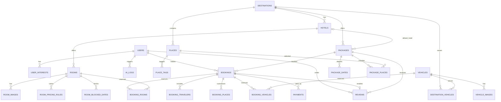

# TripCraft ER diagram

```mermaid
erDiagram
    USERS ||--o{ USER_INTERESTS : has
    USERS ||--o{ BOOKINGS : makes
    USERS ||--o{ REVIEWS : writes
    USERS ||--o{ AI_LOGS : triggers
    DESTINATIONS ||--o{ PLACES : contains
    PLACES ||--o{ PLACE_TAGS : tagged
    DESTINATIONS ||--o{ HOTELS : has
    HOTELS ||--o{ ROOMS : offers
    ROOMS ||--o{ ROOM_IMAGES : has
    ROOMS ||--o{ ROOM_PRICING_RULES : varies
    ROOMS ||--o{ ROOM_BLOCKED_DATES : blocks
    DESTINATIONS ||--o{ DESTINATION_VEHICLES : serves
    VEHICLES ||--o{ DESTINATION_VEHICLES : serves
    VEHICLES ||--o{ VEHICLE_IMAGES : has
    DESTINATIONS ||--o{ PACKAGES : offers
    HOTELS o|--o{ PACKAGES : default_hotel
    PACKAGES ||--o{ PACKAGE_DATES : departs
    PACKAGES ||--o{ PACKAGE_PLACES : includes
    PLACES ||--o{ PACKAGE_PLACES : selected
    BOOKINGS ||--o{ BOOKING_TRAVELERS : includes
    BOOKINGS ||--o{ BOOKING_PLACES : customizes
    BOOKINGS ||--o{ BOOKING_ROOMS : reserves
    BOOKINGS ||--o{ BOOKING_VEHICLES : reserves
    BOOKINGS ||--o{ PAYMENTS : paid_by
    BOOKINGS ||--o| REVIEWS : enables
    PACKAGES ||--o{ BOOKINGS : booked
    PACKAGES ||--o{ REVIEWS : receives
    ROOMS ||--o{ BOOKING_ROOMS : reserved
    VEHICLES ||--o{ BOOKING_VEHICLES : reserved
```

The authoritative physical schema is `backend/src/main/resources/db/migration/V1__create_schema.sql`; seed data is in `V2__seed_data.sql`.
